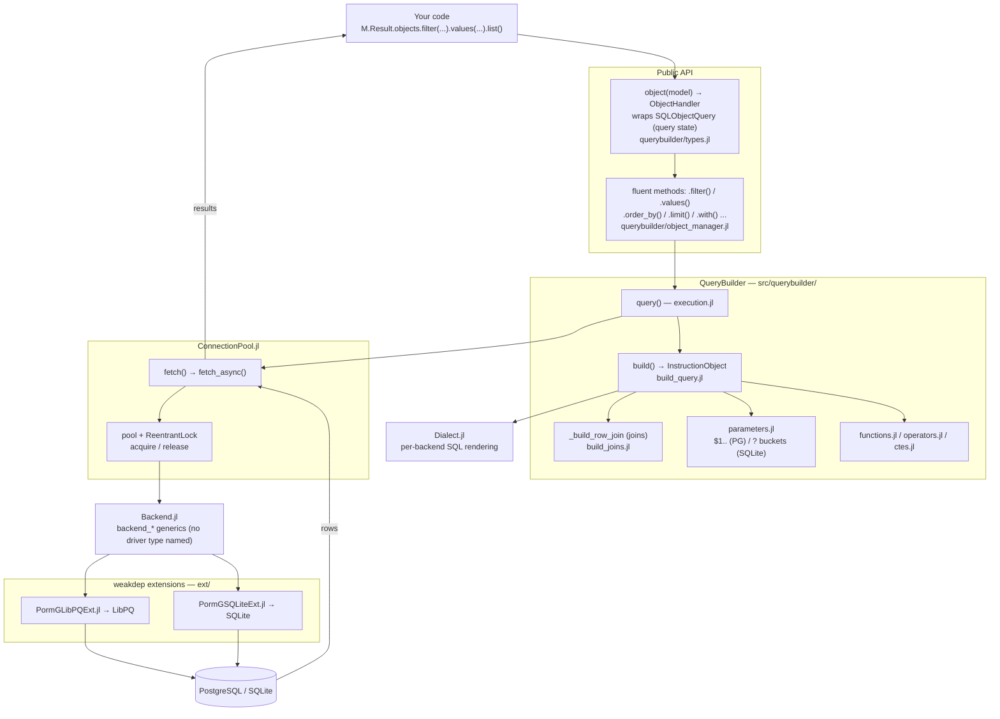
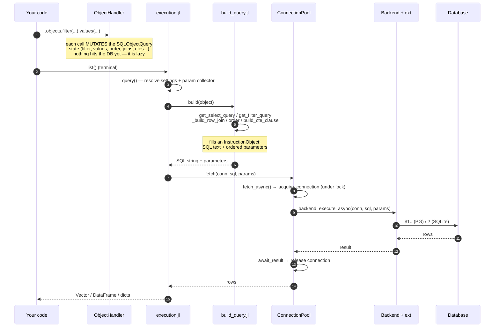
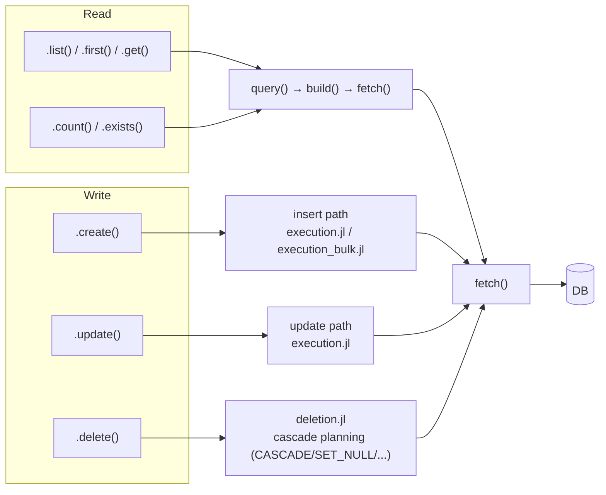
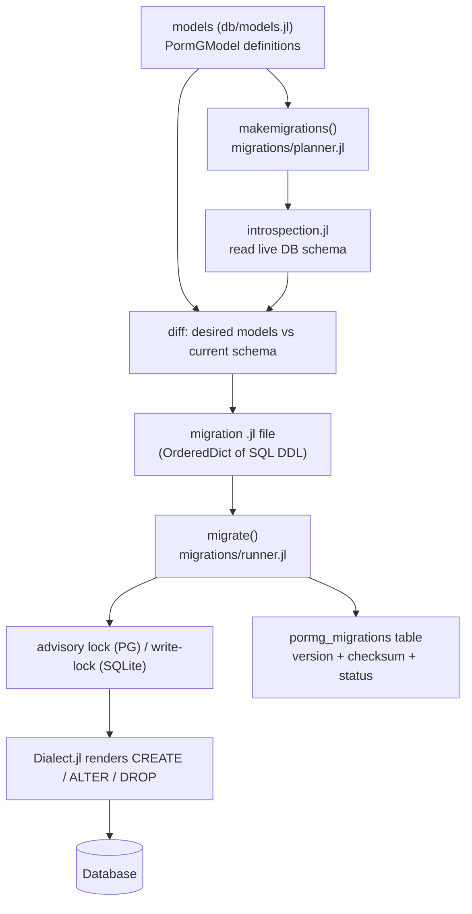

# Architecture & Request Flow

A map of how a query travels from your fluent call to the database and back. File references
point at the real definitions so you can jump in and read the body.

!!! note "Type naming"
    The **abstract** types are `SQLObject`, `SQLObjectHandler`, `SQLInstruction`; the **concrete**
    ones you actually hold are `SQLObjectQuery` (the query state), `ObjectHandler` (the chainable
    wrapper), and `InstructionObject` (the per-query SQL builder).

## Layers (who depends on whom)

The key idea: **core never names a concrete driver type.** `Backend.jl` declares `backend_*`
generics; the real bodies live in the `ext/` weak-dependency extensions, loaded only when `LibPQ`
or `SQLite` is present.

## Read path — the query lifecycle

The two things worth internalizing:

1. **Lazy until a terminal.** `filter/values/order_by/...` only mutate the `SQLObjectQuery`. No SQL
   exists until a terminal (`list/first/get/count/exists/create/update/delete`) calls `query()`.
2. **Sync wraps async.** `fetch()` is a thin wrapper over `fetch_async()`. The pool is guarded by a
   `ReentrantLock`; the connection is returned to the pool in `await_result` once the rows are
   materialized.

## Terminals — read vs write

Every terminal funnels through the same `build → parameters → Dialect → fetch` machinery; only the
clause it emits (SELECT vs INSERT vs UPDATE vs DELETE) differs.

## Migrations — a separate flow

State-based reconciliation: compare model definitions against the live schema, emit DDL, track it.

## Known architectural edges

The macro-structure above is sound — Django-shaped layers and a clean backend seam. A skeptical
audit turned up no outstanding confirmed correctness bugs; the notes below are maintainability
characterizations worth stating plainly.

### Maintainability edges (no correctness impact)

- **Model-load lifecycle (the one genuine flow gap)** —
  [#65](https://github.com/PingoLee/PormG.jl/issues/65). FK / one-to-one / many-to-many / CTE
  *target resolution* happens lazily and ad-hoc in several places (the join builder resolves
  bindings inline via `getfield(module, …)` / `invokelatest`, M2M scans all models, CTEs resolve
  their own way). There is no single "load + resolve" pass between *models defined* and
  *queries/migrations run* (Django's `apps.populate()` analog). Highest-leverage improvement — it
  removes *why* the join builder does resolution inline, and retires the world-age-risky reflection.

- **Join builder shape** — [#68](https://github.com/PingoLee/PormG.jl/issues/68). `_build_row_join`
  resolves the first hop and each subsequent hop with near-duplicate branch chains, and the join
  plan is carried as stringly-typed `Vector{Dict{String, …}}`. The tracked refactor is
  behavior-preserving (collapse the duplication) and optionally introduces a typed `JoinPlan`/
  `JoinNode` struct. Best done *after* #65, which simplifies the resolution it depends on.

- **Type stability is structural, not cosmetic** —
  [#41](https://github.com/PingoLee/PormG.jl/issues/41). The query state is built on
  `Dict{String, Any}` + heavy `Union` fields, the fluent API dispatches via a runtime
  `sym === :filter` ladder, SQL rendering runs through `getfield(Module, Symbol(...))` reflection
  per query, and `fetch` returns `Any`. This is baked into the core types — not fixable in function
  bodies. Honest nuance: low-leverage for *runtime latency* (it runs once per query to produce a
  string), but it drives TTFX/allocations and the `invokelatest` world-age fragility on the join path.

- **Positional-parameter buckets (deliberate, contained)** — for SQLite the positional `?` markers
  are collected into per-clause buckets and flattened in SQL-clause order
  (`:cte → :select → :update → :join → :where → :having`). The flatten order is single-sourced in
  `_BUCKET_ORDER` (which `get_final_parameters` and the nested-run machinery both read) and guarded by `test_alignment_sqlite.jl` / `test_parameters.jl`. Noted here
  so it is not mistaken for accidental coupling.

  Two costs, not one. *Adding a new bucket* is a documented multi-site edit (see the QueryBuilder
  skill's maintenance checklist). The subtler one: a bucket is chosen by the builder phase that binds
  a value, while correctness depends on where that value's `?` is **emitted** — and those diverge
  whenever a fragment renders somewhere other than its own clause. Three bugs came out of that gap —
  #421 a relocated fragment and #432 a nested render, both SQLite-only, plus #441 a discarded
  projection, whose *parameter* desync was SQLite-only but which dropped the column itself on **both**
  backends. All three were silent. A nested render now re-emits its values as one clause-ordered run at its own marker
  position (`nested_parameter_mark` / `detach_nested_run!`). All four such sites in the **read**
  builder go through it — `Exists`, a projected `Subquery`, an `__@in` subquery, and a CTE body.

  `deletion.jl` splices subqueries into hand-built `DELETE`/`UPDATE` clauses without it, and is
  correct today only by coincidence: it builds a fresh collector per statement, and a lone
  subquery's own text order *is* `_BUCKET_ORDER`, so the flatten happens to agree. That is a
  narrower claim than "contained", and deliberately so.

!!! note "\"Async-first\" is backend-specific"
    For **PostgreSQL** the async path is genuine: the pool lock is released before the round-trip and
    `LibPQ.async_execute` is real non-blocking I/O, so queries on separate connections overlap. For
    **SQLite**, every statement is funnelled through a single global worker (serialized), with write
    transactions further pinned behind a process-wide lock — pool size buys no query-level
    concurrency. "Async-first" is a real PostgreSQL capability, not a blanket ORM property.
    Usage patterns live in the [Async & Concurrency guide](async.md).

## Where to look next

| You want to understand… | Start at |
|---|---|
| How `.objects` and chaining work | `src/querybuilder/object_manager.jl`, `types.jl` (`SQLObjectQuery`, `object()`) |
| How SQL text is assembled | `src/querybuilder/build_query.jl` (`build`), `build_joins.jl`, `ctes.jl` |
| Parameter ordering (PG `$1` vs SQLite `?` buckets) | `src/querybuilder/parameters.jl` |
| Backend-specific SQL | `src/Dialect.jl` |
| Pool, async, transactions | `src/ConnectionPool.jl` |
| Driver bodies | `ext/PormGLibPQExt.jl`, `ext/PormGSQLiteExt.jl` |
| Schema reconciliation | `src/Migrations.jl`, `src/migrations/` |
